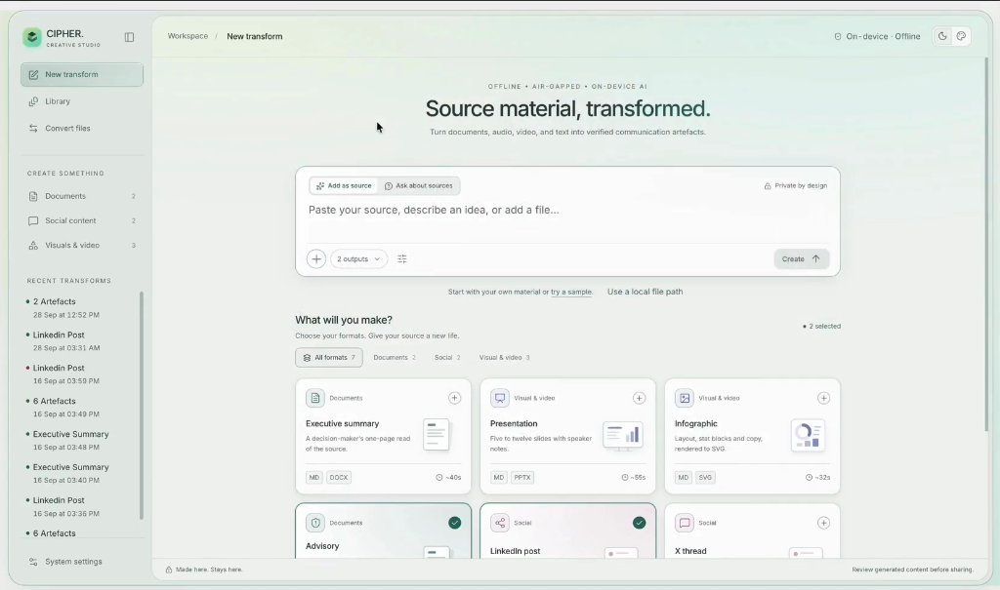
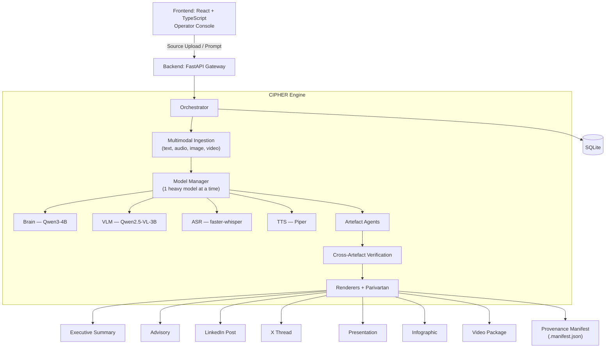
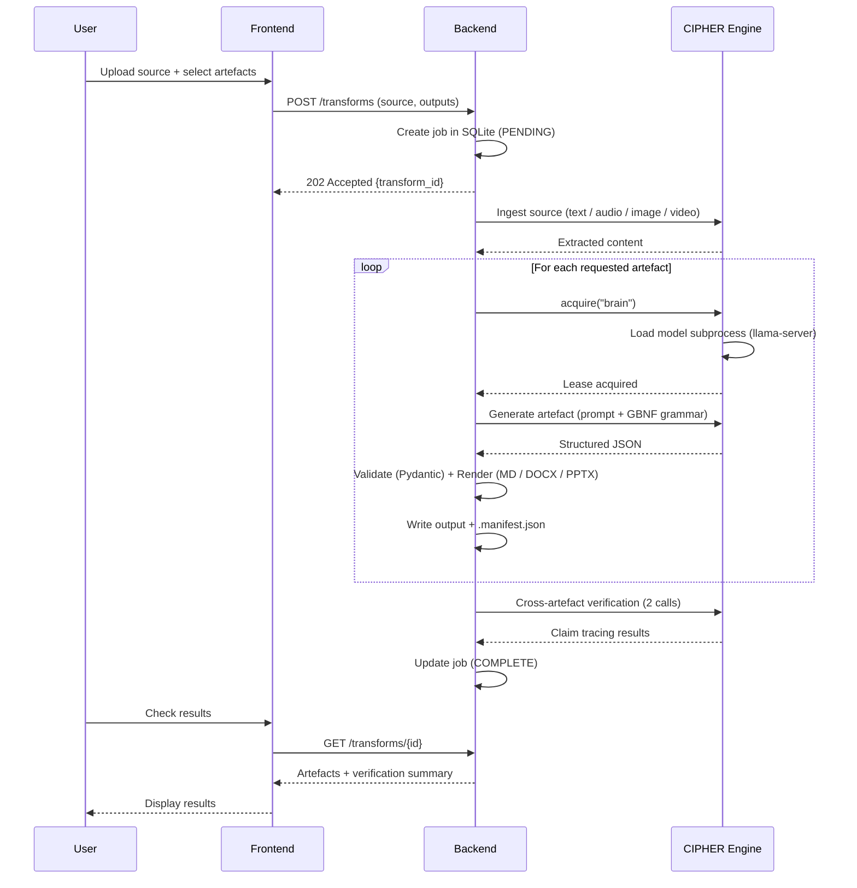

<div align="center">

# 🔐 CIPHER

### **Cyber Intelligence & Content Transformation Engine**

*Offline, Air-Gapped AI-Powered Content Transformation System*

[](https://www.python.org/downloads/release/python-3110/)
[](https://fastapi.tiangolo.com/)
[](https://github.com/ggerganov/llama.cpp)
[]()
[]()

---

CIPHER is a cybersecurity-focused content transformation system that converts structured and unstructured intelligence into verified outputs. Leveraging a local domain-adapted LLM, unified evidence modeling, and automated fact validation, it delivers accurate, consistent, and secure intelligence products **entirely on-premises**.

**Source content in** (text, document, image, audio, video, or free-form prompt) →  
**Communication artefacts out** (executive summary, advisory, LinkedIn post, X thread, presentation, infographic spec, video package).

`🔒 100% Offline` · `☁️ No Cloud` · `📄 10+ Formats` · `🧠 1 Brain`

</div>

---

## ✨ Features Offered

| # | Feature | Description |
|---|---------|-------------|
| 1 | **Cybersecurity-Native Local LLM** | Unlike generic AI systems, CIPHER uses a domain-adapted cyber security model which can be switched as per availability, capable of understanding threat intelligence reports, IOC data, CVEs, attack chains, advisories, and security terminology — without cloud dependence. |
| 2 | **One Input → Multiple Verified Deliverables** | A single source can automatically generate presentations, advisories, executive summaries, social posts, infographics, video packages, and technical reports while maintaining factual consistency across all outputs. |
| 3 | **Fully Offline & Air-Gapped Operation** | Designed for government, defense, and critical infrastructure environments. Runs entirely on local hardware with zero cloud dependency, ensuring complete data sovereignty and privacy. |
| 4 | **Multi-Format Intelligence Extraction** | Processes PDFs, DOCs, images, videos, XML, XLSX, threat feeds, IOC lists, STIX/TAXII-style intelligence, and other structured cybersecurity data into a unified evidence representation. |
| 5 | **Evidence-Backed Fact Verification** | Every generated claim is traced back to its source evidence, with automatic detection of unsupported or conflicting statements before release. |
| 6 | **AI-Free Format Conversion (Parivartan)** | Performs deterministic tabular data transformations (CSV, JSON, Parquet, etc.) and native cyber intelligence conversions (STIX 2.1, Sigma, CEF) **entirely offline with zero AI hallucination risk**. |

---

## 📖 Table of Contents

- [UI Preview](#-ui-preview)
- [Features Offered](#-features-offered)
- [System Architecture](#-system-architecture)
- [Sequence Flow](#-sequence-flow)
- [Status](#-status)
- [Quick Start](#-quick-start)
- [Docker](#-docker)
- [Development](#-development)
- [Hardware Profiles](#-hardware-profiles)
- [Tech Stack](#-tech-stack)

---

## 🖥️ UI Preview

<div align="center">



*CIPHER Creative Studio — The operator console for creating transforms and managing artefacts.*

</div>

---

## 🏗️ System Architecture



---

## 🔄 Sequence Flow



---

## 📊 Status

Phases 0–8 complete: frozen contracts, model manager (one heavy model, child processes, SIGTERM
unload), text generation, all seven artefact agents, the API, renderers, Parivartan
converters, multimodal ingestion, video assembly, and the air-gap / audit / `selfcheck`
layer. Phase 9 (frontend) is deferred. See `MEMORY.md` for the live state and `PLAN.md` for
the plan.

### Hard Invariants

| ID | Invariant |
|----|-----------|
| INV-1 | No ML model is ever loaded inside the API process — all models run as supervised child processes |
| INV-2 | At most 1 heavy model resident at any moment |
| INV-3 | Every converter/renderer imports heavy deps inside the function, never at module top level |
| INV-4 | No outbound network connection to a non-loopback address at runtime |
| INV-5 | Every artefact file has a sibling `.manifest.json` provenance record |
| INV-6 | Every model output passes Pydantic schema validation before reaching a renderer |
| INV-7 | `ModelManager.acquire()` is the only code path that starts a model process |
| INV-8 | Unload is process termination (SIGTERM), never Python garbage collection |

---

## 🚀 Quick Start

### 1. Online Prep (do this once, with the network on)

```bash
# 1. Python 3.11 exactly — the vendored wheels target 3.11.
uv python install 3.11
uv venv --python 3.11 && source .venv/bin/activate

# 2. Vendor the whole dependency closure as wheels + write requirements-lock.txt.
#    Run this on the SAME OS/arch as the air-gapped laptop.
PYTHON=$(uv python find 3.11) scripts/vendor_wheels.sh

# 3. Fetch the four model files (~7 GB) into models/.
scripts/fetch_models.sh

# 4. Vendor the console's webfont, then build it. Both are committed to the repo,
#    so re-run these only to change the font or rebuild the UI.
scripts/fetch_fonts.sh
scripts/vendor_frontend.sh

# 5. Install the project and verify everything.
uv pip install -e ".[dev]"
python -m rupantar.cli selfcheck        # expect an all-green table
```

`selfcheck` hashes every model file against `configs/models.yaml`, boots the brain once to
confirm GPU offload is actually active, load/unloads it to prove memory is reclaimed, and
scans this process tree for any non-loopback connection.

### 2. Cut the Network

Physically disconnect. Nothing below touches the network — `selfcheck` check 8 and the
`INV-4` test prove it, and every process sets `HF_HUB_OFFLINE=1` / `TRANSFORMERS_OFFLINE=1`
at startup.

### 3. Run (offline)

```bash
# Install from the vendored wheels — no index, no network.
pip install --no-index --find-links vendor/wheels -r requirements-lock.txt
pip install --no-index --no-deps -e .

python -m rupantar.cli selfcheck                 # still green with the network off
scripts/demo.sh                                  # the full scripted demo (PLAN.md section 8)

# one transform
python -m rupantar.cli transform --text article.md \
  --output executive_summary,advisory,linkedin_post

# a multimodal transform
python -m rupantar.cli transform --source clip.mp4 --output video_package

# strict air-gap: abort a job if a non-loopback connection appears
python -m rupantar.cli transform --text article.md --output advisory --strict-airgap

# the API (single worker)
uvicorn rupantar.api.app:create_app --factory --host 127.0.0.1 --port 8000
#   GET /health         GET /health/egress
#   POST /transforms    GET /transforms/{id}    GET /transforms/{id}/artefacts
#   GET  /models         POST /convert
```

Every artefact written to disk gets a sibling `<name>.manifest.json` with the source SHA-256,
model file SHA + quant, prompt version, generation params, and timestamps.

### The Operator Console

With `frontend/dist/` present, the same uvicorn process serves the UI at `/` — one process,
one port, no node runtime on the air-gapped machine. Open `http://127.0.0.1:8000/`.

The console is a Vite + React + TypeScript app under `frontend/`. **The air-gapped machine
never runs `npm ci`**: the built `dist/` is committed, and `scripts/vendor_frontend.sh` is what
produces it on a machine that has node. That script is also the air-gap gate — after building
it checks that every CSS `url()` and every `src`/`href` in `index.html` is same-origin, and
that no unexpected remote URL survived into the bundle. A stray CDN reference fails the build
there rather than failing INV-4 on the day. Fonts are `woff2` files committed under
`frontend/public/fonts/` (Inter, SIL OFL, weights 400 and 500), never fetched from a font host.

```bash
scripts/vendor_frontend.sh     # build + air-gap gate; commit frontend/dist/ afterwards
cd frontend && npm run dev     # dev only, proxies the API to 127.0.0.1:8000
```

### Cross-Artefact Verification

After every transform's artefacts are generated (while the brain lease is still warm), CIPHER
makes exactly two extra brain calls, total, to trace factual claims back to the source: one call
extracts every atomic claim across every requested artefact, one call checks each claim against
the source evidence pack (`SUPPORTED` / `UNSUPPORTED`, with the evidence IDs) and cross-checks
claims against each other (`AGREE` / `CONFLICT` / `ORPHAN`). The result lands in every artefact's
`.manifest.json` under `verification`, in `GET /transforms/{id}` as a one-line summary, and on the
CLI as `verification: 23 claims · 21 supported · 1 unsupported · 1 CONFLICT`.

> [!WARNING]
> **This does not guarantee correctness.** It traces factual statements to source evidence and
> flags what it could not substantiate — a claim can be `SUPPORTED` and still wrong if the source
> itself is wrong, and an `UNSUPPORTED` claim may still be true but simply absent from the dossier.
> Treat it as a triage aid, not a certification. Disable it (skips both brain calls, zero added
> latency) via `configs/policy.yaml:verification.enabled: false`.

---

## 🐳 Docker

Everything (API, operator console, `llama-server` pinned to llama.cpp `b10809`, the whisper
worker, `piper`, `ffmpeg`) runs from one image. Model weights stay on the host in `./models`
(mounted read-only); outputs and the SQLite DB land in `./data`.

```bash
# online, once
scripts/fetch_models.sh
docker compose build
make docker-save                  # -> vendor/cipher-images.tar.gz (cipher + nginx)

# on the air-gapped machine
make docker-load
docker compose up -d              # console at http://127.0.0.1:8000/  (CIPHER_PORT=… to move it)
docker compose exec cipher cipher selfcheck
make docker-test                  # `make check` inside the Linux image
```

The `cipher` container sits only on an `internal` Docker network, so it has **no route off
the host at all**. An nginx `gateway` is the only thing on both networks, and it forwards only
`127.0.0.1:8000` inward. The egress monitor treats clients connected to our own listening port
as ingress, so browser traffic through the gateway does not show up as a violation.

> [!NOTE]
> **Performance:** Docker on macOS has no Metal, so inside the container the profile auto-detects
> to `cpu-only` (~2× slower than `apple-metal`; llama.cpp is built with every CPU variant and picks
> the best one at run time). Docker Desktop's VM also caps RAM (8 GB by default). Raise it to
> ≥10 GB in Docker Desktop → Resources if you want the vlm and brain to swap comfortably. For the
> timed demo on the M4 Air, run natively. The container is for portability and Linux hosts. An
> NVIDIA/CUDA image variant is not built yet.

---

## 🛠️ Development

```bash
make check        # ruff check + ruff format --check + mypy src + pytest tests/unit + pytest tests/inv
make check-all    # + integration tests with the stub runtime
make check-real   # + slow tests that need real model files
python -m rupantar.cli selfcheck        # full system health report
python -m rupantar.cli models status    # resident models and memory
```

---

## ⚙️ Hardware Profiles

The hardware profile is selected automatically at startup and logged at INFO:

| Detected | Profile | llama.cpp needs |
|----------|---------|-----------------|
| macOS on Apple Silicon | `apple-metal` | a Metal build (`brew install llama.cpp` gives this) |
| `nvidia-smi` on PATH | `nvidia-cuda` | a **CUDA build** — a plain build ignores the GPU |
| anything else | `cpu-only` | any build (slow: `-ngl 0`, ~2× slower than GPU) |

`RUPANTAR_PROFILE=<name>` forces a profile (`titan-24gb` for the 24 GB-GPU tier, `test-stub`
for tests). If detection is unsure it falls back to `cpu-only` and says so loudly in the log.

> [!IMPORTANT]
> **The llama.cpp binary must be built for the right backend.** `brew install llama.cpp` on macOS
> is Metal-enabled. On Linux with an NVIDIA GPU you need a CUDA-compiled `llama-server` (build with
> `-DGGML_CUDA=ON`, or use a CUDA release binary) — otherwise `--n-gpu-layers 99` is a silent no-op
> and the GPU sits idle. `selfcheck` check 4b boots the brain with `-v`, reads the
> `offloaded N/M layers to GPU` line, and **fails loudly** when a GPU profile offloads 0 layers.

---

## 📚 Tech Stack

| Concern | Choice |
|---------|--------|
| Language | Python 3.11 (pinned via `uv`) |
| API | FastAPI + uvicorn (single worker) |
| LLM/VLM | `llama.cpp` llama-server, GGUF Q4_K_M |
| ASR | `faster-whisper` (int8, subprocess) |
| TTS | `piper` CLI (~60 MB) |
| Media | `ffmpeg` CLI |
| Job State | SQLite (`aiosqlite`) |
| Queue | In-process `asyncio` priority queue |
| Schemas | Pydantic v2 |
| Config | YAML + Pydantic Settings |
| CLI | Typer |
| Frontend | Vite + React + TypeScript |
| Tests | pytest + pytest-asyncio |
| Lint | ruff + mypy |

---

<div align="center">

See [`PLAN.md`](PLAN.md) for the phase plan and [`docs/SCHEMAS.md`](docs/SCHEMAS.md) for the frozen contracts.

---

*Built for NTRO / SIH — designed to run where no network can reach.*

</div>
